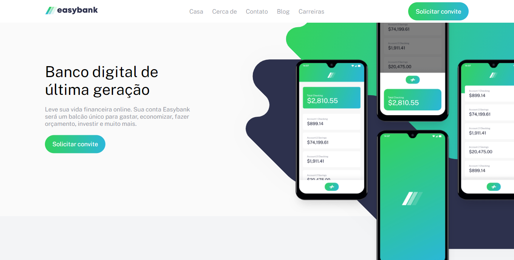

#  Easybank landing page

## Conteúdo
- [Sobre](#sobre)
- [Links](#link)
- [Tecnologias](#tecnologias)
- [Autor](#autor)

##  Sobre
Esta é uma solução para o [desafio da Easybank landing page no Frontend Mentor](https://www.frontendmentor.io/challenges/easybank-landing-page-WaUhkoDN), responsivo para grande parte dos dispositivos. A Easybank é um banco digital de última geração.

##  Link
- Site - https://landingpage-easybank.netlify.app

##  Tecnologias
- Tags semânticas do HTML5
- Propriedades comuns do CSS
- Flexbox
- CSS Grid

##  Autor
Perfil no Frontend Mentor - https://www.frontendmentor.io/profile/sanchesspoladore